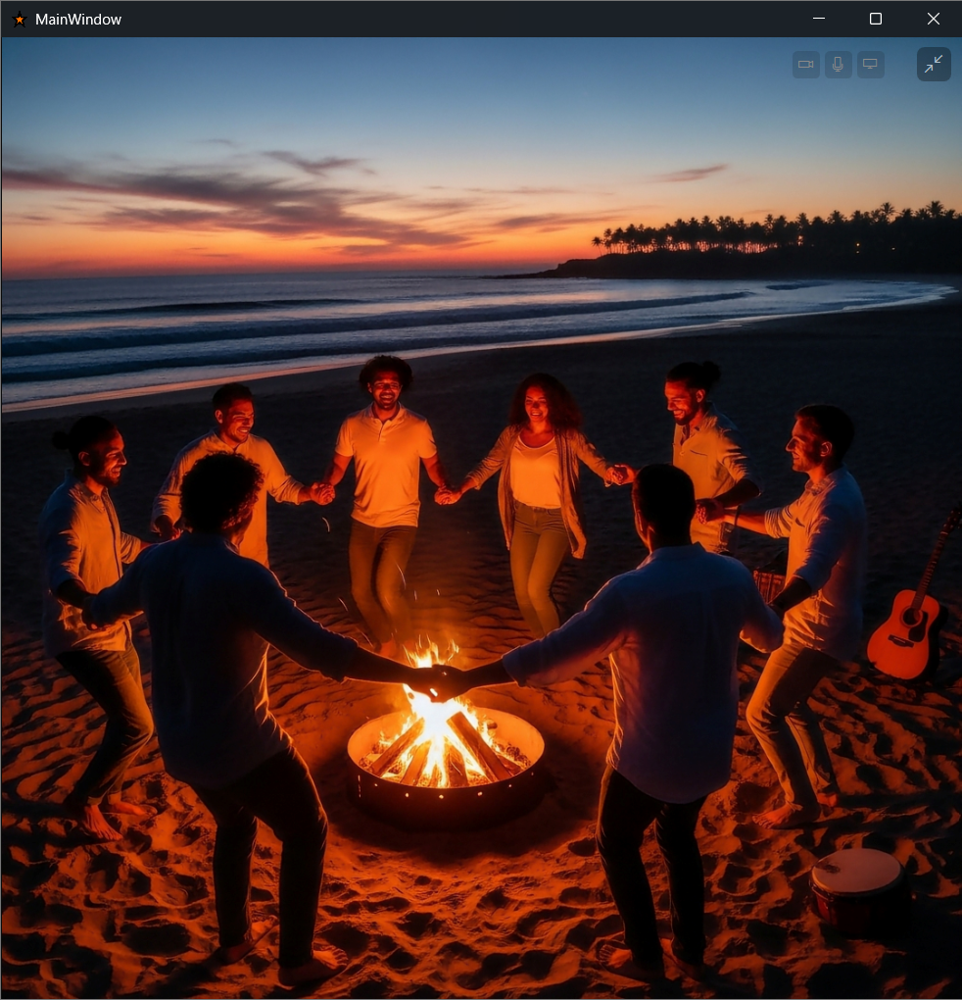

# TestImage

**Bilder durchsehen und Unerwünschtes aussortieren — mit den Pfeiltasten, ohne
die Hand von der Tastatur zu nehmen.**

Dafür ist das Programm gebaut. Wer mehrere hundert Bilder in einem Ordner hat und
entscheiden muss, was bleibt, sitzt sonst stundenlang mit der Maus davor. Hier
liegt eine Hand auf den vier Pfeiltasten, und das reicht:

| Taste | |
|---|---|
| **→** | nächstes Bild |
| **←** | voriges Bild |
| **↓** | weg damit — das Bild wandert nach `kein_Fav` |
| **↑** | zurückholen, sonst die letzte Verschiebung rückgängig |

Verschoben wird in einen Unterordner, nicht gelöscht. Jeder Griff lässt sich
zurücknehmen.


Und dasselbe Bild im Vollbild — nichts als das Bild, Zoom mit dem Mausrad. Die
Pfeiltasten tun hier dasselbe, nur ohne sichtbare Rückmeldung:



Alles Weitere — Dubletten, Prüfungen, Konturansicht, Begriffssuche — ist Beiwerk
für den Fall, dass das blosse Ansehen nicht reicht.

Quelltext und Kommentare sind auf Deutsch.

## Was er sonst noch kann

**Weitere Ablagen**
`↓` legt nach `kein_Fav`, `Umschalt+↓` nach `Besonders`. Im Bildmodus zusätzlich
`K` für `KI_Fehler`. Dazu gibt es `Doppelt` und `Wasserzeichen`. Aus jeder dieser
Ablagen führt ein Knopf wieder eine Ebene höher.

**Alle Tastenkürzel** stehen im Programm selbst unter **F1**.

**Dubletten finden**
Drei Wege, von streng zu tolerant:

| Verfahren | tut |
|---|---|
|  Byte-Vergleich | sucht dasselbe Bild — Byte für Byte, ohne Toleranz |
|  SHA256 | durchsucht den ganzen Ordner ohne Anfragebild und stellt zusammen, was doppelt liegt |
|  Grauwert-Hash | sucht dasselbe Bild, auch in anderer Grösse oder Qualität — 8×8 Graustufen, bis zu 10 von 64 Bit dürfen abweichen |


**Bilder prüfen**
Auf Wunsch wird jedes angezeigte Bild geprüft. Das Ergebnis steht als Ampel neben
dem Bild:

| Prüfung | schlägt an bei |
|---|---|
| Datei lesbar | beschädigten oder gesperrten Dateien |
| Dateikopf passt zur Endung | einem PNG, das `.jpg` heisst |
| Decoder liefert ein Bild | Formaten, die Windows nicht kennt |
| Abgebrochener Download | fehlender Endkennung (`EOI`, `IEND`, `RIFF`), einem Decoder-Fehler, oder einer letzten Bildzeile, die zu über 90 % aus exaktem Mittelgrau besteht — so endet ein JPEG, dessen Übertragung mittendrin abbrach |
| Leere Datei | 0 Byte |

**Konturansicht**
Zeigt statt des Bildes sein Kantenbild (Sobel) mit einstellbarer Schwelle. Macht
schwache Aufdrucke und Wasserzeichen sichtbar.

**Begriffssuche** *(braucht die zwei Modelldateien, siehe unten)*
Ein einmal indizierter Ordner lässt sich danach nach **Inhalt** durchsuchen, nicht
nur nach Dateinamen. Der Index liegt im Ordner selbst und wandert mit ihm mit.

| | |
|---|---|
| **Freitextsuche** | „zwei Personen am Strand" eintippen. Auf Deutsch — ein Übersetzer davor bildet die Anfrage auf das englische Vokabular des Modells ab. |
| **Erkannte Begriffe** | Zu jedem Bild werden Begriffe vorgeschlagen, anklickbar als Suchanfrage. |
| **Heatmap** | Zeigt im Bild, *wo* ein Begriff sitzt — nützlich, um zu sehen, ob das Modell das Richtige gemeint hat. |
| **Schema-ähnlich** | Bilder mit ähnlichem Aufbau oder Motiv finden. Löst die grobe Perceptual-Hash-Suche ab. |
| **Serien finden** | Zusammengehörige Bilder eines Satzes aufspüren. |

Die Treffer landen in einer Liste; über „In Liste übernehmen" wird die
Navigation auf genau diese Bilder eingedampft — danach blättert man mit den
Pfeiltasten nur noch durch sie.


**Sortieren nach gelernten Vorlieben** — ⚠️ **in Arbeit, etwa zu 10 % fertig**
Die Idee: Der Ordner wird nach den bisherigen Entscheidungen geordnet,
wahrscheinlicher Ausschuss zuerst. Gelernt wird aus dem Ordner selbst und seinem
`kein_Fav`. Das steckt noch in der Erprobung und liefert keine verlässlichen
Ergebnisse — wer es ausprobiert, sollte den Vorschlägen nicht trauen. Verschoben
wird dabei nichts.

## Installieren

Es gibt kein Installationsprogramm. Auspacken, starten, fertig.

1. **Windows 10 (Build 18362) oder neuer.**
2. Einmalig die **[.NET 10 Desktop Runtime](https://dotnet.microsoft.com/download/dotnet/10.0)**
   installieren — bei „Run desktop apps" die Fassung für **x64**. Ohne sie
   startet die Anwendung nicht.
3. Das ZIP aus den [Releases](https://github.com/DimschAusD/TestImage/releases)
   irgendwohin auspacken und `TestImage.exe` starten.

### Damit auch die Begriffssuche läuft

Die zwei Modelldateien liegen im selben Release, einzeln zum Herunterladen. Sie
gehören in einen Unterordner `models` **neben** die `TestImage.exe`:

```
TestImage\
├─ TestImage.exe
└─ models\
   ├─ clip-vit-b32-vision.onnx     335 MB
   ├─ clip-text.onnx               242 MB
   ├─ clip-vocab.json              (schon im ZIP)
   └─ clip-merges.txt              (schon im ZIP)
```

Ohne die beiden grossen Dateien läuft alles Übrige unverändert — nur die
Begriffssuche bleibt aus.

## Wo die Anwendung ihre Daten ablegt

**Nichts** in der Registrierung, **nichts** unter `AppData`. Gemerkt wird an zwei
Orten:

**Neben der `TestImage.exe`:**

```
index.ordner.json             welche Ordner indiziert sind
wasserzeichen.masken.json     die gelernten Wasserzeichen-Muster
fav.profile.json              die gelernten Vorlieben
```

**In jedem Bilderordner**, sobald man ihn indiziert, auf Wasserzeichen prüft oder
den Text lesen lässt:

```
.bildindex.clip.json          die Bildmerkmale dieses Ordners
.bildwasserzeichen.json       die Wasserzeichen-Befunde dieses Ordners
.bildocr.json                 der erkannte Text dieses Ordners
```

Die drei liegen mit Absicht dort und nicht bei der Anwendung: So wandern sie mit,
wenn du den Bilderordner verschiebst oder auf eine andere Platte kopierst, und
müssen nicht neu gerechnet werden. Sie sind auch nicht versteckt — so sieht man
beim Durchblättern im Explorer, welche Ordner schon bearbeitet sind.

## Deinstallieren

Den ausgepackten Ordner löschen. Das war es — es gibt keine Einträge in der
Registrierung und nichts unter `AppData`.

**Was liegen bleibt:** die Cache-Dateien in jedem Bilderordner, den du bearbeitet
hast. Wer sie loswerden will, sucht im Explorer nach

```
.bildindex.clip.json
.bildwasserzeichen.json
.bildocr.json
```

und löscht die Treffer. **`.bildocr.json` sollte man dabei nicht vergessen** —
darin steht der erkannte Text im Klartext.

## Bauen

Vorausgesetzt sind **Windows 10 (Build 18362) oder neuer** und das
**.NET 10 SDK**.

```
git clone https://github.com/DimschAusD/TestImage.git
cd TestImage
dotnet build
```

Das war es — alle Abhängigkeiten kommen über NuGet, es gibt nichts von Hand
nachzuinstallieren.

### Ein Verteilpaket bauen

```
dotnet publish TestImage.csproj -c Release -r win-x64 --self-contained false -o veroeffentlichung
```

Das `-r win-x64` ist wichtig und keine Feinheit: Ohne festgelegte Plattform
kopiert der Build die nativen Teile der ONNX-Laufzeit für **alle** Systeme mit
— iOS, Android, macOS, Linux, ARM. Das sind 149 MB, die unter Windows nie
angefasst werden. Mit der Angabe bleibt das Paket bei rund 37 MB.

### Die CLIP-Modelle

Der Build läuft auch ohne sie durch und meldet nur eine Warnung. Ohne die Modelle
fehlen die Begriffssuche, „schema-ähnlich" und das Sortieren nach Vorlieben —
Betrachter, Dublettensuche, Prüfung und Konturansicht arbeiten vollständig.

Die beiden Gewichtsdateien sind zusammen rund 580 MB und liegen deshalb nicht im
Repo; GitHub lehnt einzelne Dateien über 100 MB ab. Woher man sie bekommt, steht
in [`models/LIESMICH.md`](models/LIESMICH.md).

## Aufbau

| Ordner | Inhalt |
|---|---|
| `Ansichten/` | Normalansicht, Vollbild, Dublettenansicht |
| `Bildersuche/` | Index, Wasserzeichen, Farbsignatur, WPF-Brücke |
| `Converters/` | Wertwandler für die Bindungen |
| `Geraete/` | liest aus der Registrierung, ob Kamera oder Mikrofon in Benutzung sind |
| `Images/` | `Symbole.xaml` — alle Symbole als Zeichnungen, kein PNG |
| `ImageMatching.Core/` | Bildvergleich ohne WPF: Sobel, dHash, Index |
| `ImageMatching.Cnn/` | CLIP über ONNX Runtime, Tagger, Übersetzer |

`ImageMatching.Core` und `ImageMatching.Cnn` kennen kein WPF und sind für sich
verwendbar.

## Fremde Bestandteile

| Paket | Lizenz |
|---|---|
| CommunityToolkit.Mvvm | MIT |
| Microsoft.Xaml.Behaviors.Wpf | MIT |
| Microsoft.ML.OnnxRuntime | MIT |
| System.Drawing.Common | MIT |
| CLIP ViT-B/32 (Modellgewichte) | MIT, OpenAI |

Alle Symbole sind selbst gezeichnet oder Zeichen der mit Windows gelieferten
Schriften Segoe UI Symbol und Segoe MDL2 Assets. Es liegt keine fremde Grafik im
Repo.

## Lizenz

MIT — siehe [LICENSE](LICENSE).

Privates Hobbyprojekt, Nutzung auf eigene Gefahr. Es besteht keine Gewährleistung
und keine Haftung; Einzelheiten in der [LICENSE](LICENSE).
